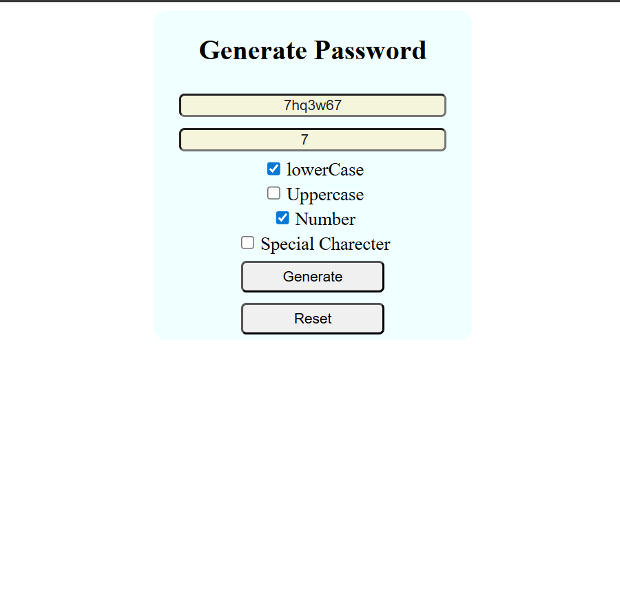

# 🔐 Random Password Generator

A simple and secure **Random Password Generator** built with **HTML**, **CSS**, and **JavaScript**. This tool allows users to quickly generate strong and customizable passwords to enhance security for online accounts.

## 🚀 Features
- Generates strong random passwords.
- Option to include uppercase, lowercase, numbers, and special characters.
- Adjustable password length.
- Copy-to-clipboard functionality.
- Responsive and clean UI.

## 🛠️ Technologies Used
- **HTML** – Website structure.
- **CSS** – Styling and layout.
- **JavaScript** – Password generation logic.

## 📸 Preview

